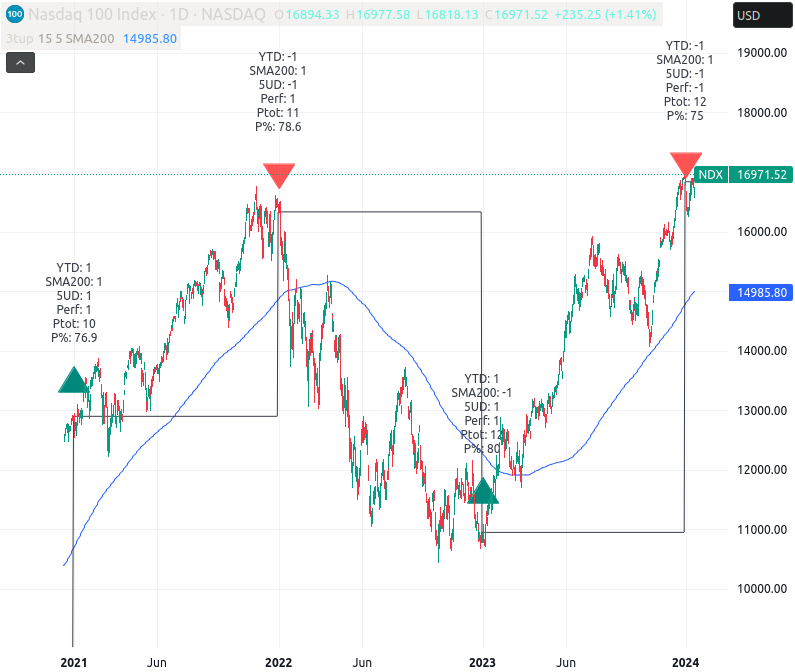
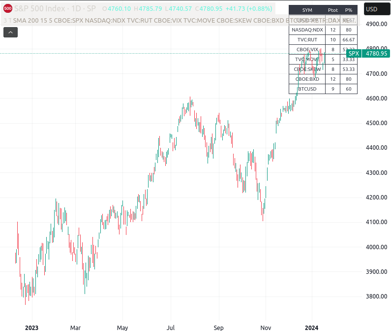

# TradingViewMisc
Contributions to TradingView indicators and strategies.

- [3 Thumbs Up Rule Single Symbol](https://www.tradingview.com/script/0geFZzbo-3-ThumbsUp-SingleSym/)
- [3 Thumbs Up Rule Multi Symbol](https://www.tradingview.com/script/1s0fo1Od-3-Thumbs-Up-Rule-Multi-Symbol/)

## 3 Thumbs Up Rule for single Symbols

1. YTD over/under (last years close)
2. First five days of year over/under open first day
3. MA over/under (default 200 SMA) 

## 3 Thumbs Up Rule for multiple Symbols (fast)

3 Thumbs Up Rule Multi Symbols Table, loading securites at new year only for faster calulation.
!!! BETA some securities like VIX and MOVE do not load correctly. !!! 

